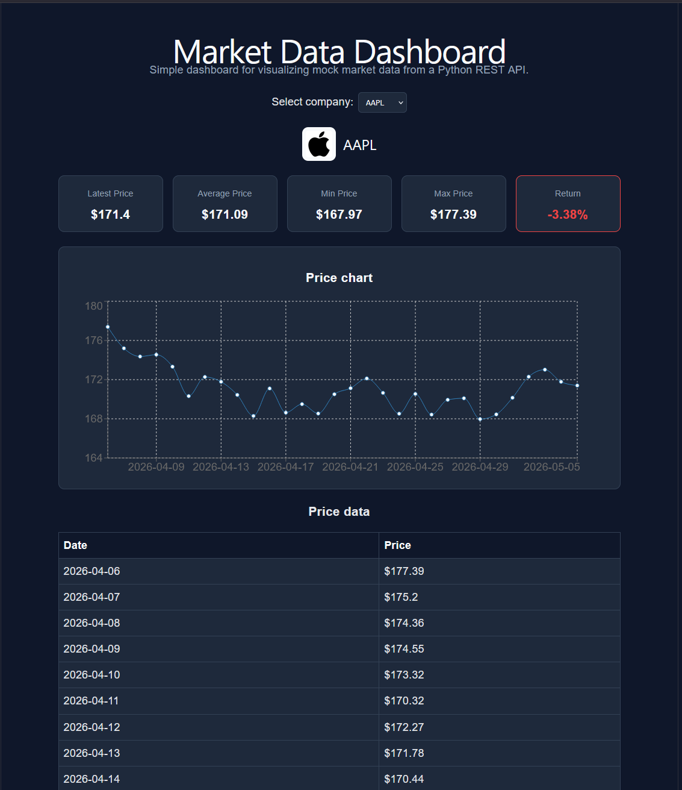
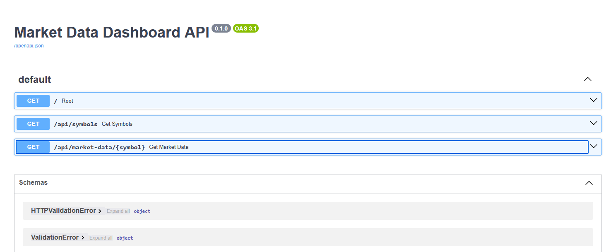
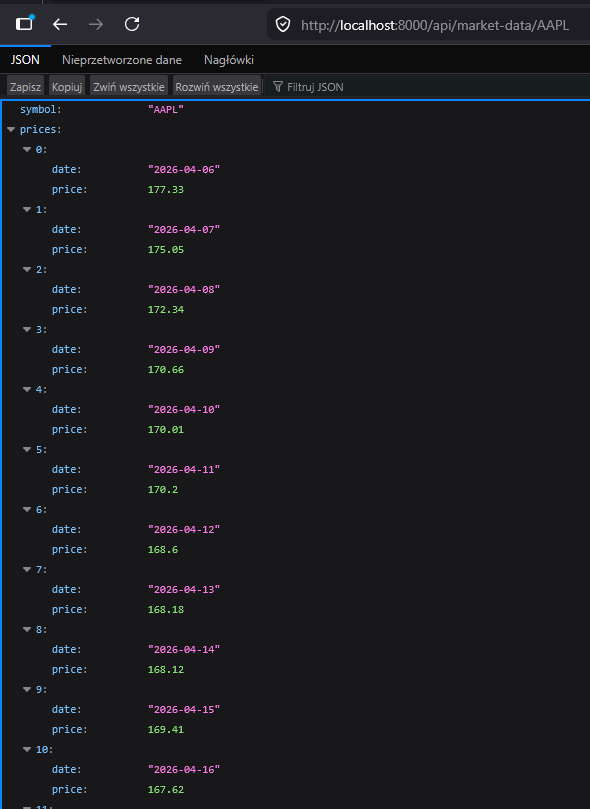

# Market Data Dashboard

A small full-stack market data dashboard built with a **Python FastAPI backend** and a **React frontend**.

The goal of this project was to practice building a data-oriented application with a REST API, frontend data fetching, chart visualization, basic error handling and simple financial statistics.

---

## Project Preview

---

## Overview

Market Data Dashboard is a simple full-stack application for displaying mock market data for selected stock symbols.

The application consists of two main parts:

1. **FastAPI backend**
   - Generates mock price data.
   - Exposes REST API endpoints.
   - Calculates basic statistics such as latest price, average price, minimum price, maximum price and return percentage.

2. **React frontend**
   - Fetches data from the backend.
   - Allows the user to select a stock symbol.
   - Displays summary statistics.
   - Shows a line chart.
   - Renders a table with historical mock prices.
   - Displays company logos and conditional styling for positive or negative returns.

This project was created as a practical example of how backend logic, REST APIs and frontend visualization can work together in a data-oriented application.

---

## Tech Stack

### Backend

- Python
- FastAPI
- Uvicorn
- CORS middleware

### Frontend

- React
- Vite
- JavaScript
- Recharts
- CSS

### Tools

- Git
- GitHub
- VS Code
- PowerShell

---

## Main Features

- REST API built with FastAPI
- Mock market data generation
- Supported stock symbols:
  - AAPL
  - MSFT
  - GOOG
  - TSLA
  - HSBC
- Statistics calculation:
  - latest price
  - average price
  - minimum price
  - maximum price
  - return percentage
- React controlled dropdown for selecting a symbol
- Frontend data fetching from REST endpoints
- Loading and error states
- Price chart using Recharts
- Historical price table
- Company logo mapping
- Dark-themed dashboard UI
- USD price formatting
- Conditional styling:
  - green return card for positive return
  - red return card for negative return

---

## Screenshots

### Dashboard Overview

### FastAPI Documentation

### Example Backend Response

---

## Project Structure

~~~text
market-data-dashboard/
│
├── backend/
│   ├── main.py
│   └── requirements.txt
│
├── frontend/
│   ├── public/
│   ├── src/
│   │   ├── assets/
│   │   │   └── logos/
│   │   │       ├── AAPL.png
│   │   │       ├── GOOG.png
│   │   │       ├── HSBC.png
│   │   │       ├── MSFT.png
│   │   │       └── TSLA.png
│   │   ├── api.js
│   │   ├── App.css
│   │   ├── App.jsx
│   │   ├── index.css
│   │   └── main.jsx
│   ├── package.json
│   ├── package-lock.json
│   └── vite.config.js
│
├── screenshots/
│   ├── dashboard-overview.png
│   ├── api-docs.png
│   └── backend-response.png
│
├── .gitignore
└── README.md
~~~

---

# Backend Overview

The backend is implemented in:

~~~text
backend/main.py
~~~

It uses FastAPI to expose REST API endpoints that can be consumed by the React frontend.

---

## Backend Imports

~~~python
from datetime import date, timedelta
from random import uniform

from fastapi import FastAPI, HTTPException
from fastapi.middleware.cors import CORSMiddleware
~~~

### Explanation

- `date` and `timedelta` are used to generate dates for mock price data.
- `uniform` is used to generate random price movements.
- `FastAPI` is used to create the backend application.
- `HTTPException` is used to return proper HTTP errors.
- `CORSMiddleware` allows the React frontend to communicate with the backend when running on a different local port.

---

## FastAPI Application

~~~python
app = FastAPI(title="Market Data Dashboard API")
~~~

This creates the FastAPI application instance.

The title is visible in the automatically generated API documentation available at:

~~~text
http://localhost:8000/docs
~~~

---

## CORS Configuration

~~~python
app.add_middleware(
    CORSMiddleware,
    allow_origins=["http://localhost:5173"],
    allow_credentials=True,
    allow_methods=["*"],
    allow_headers=["*"],
)
~~~

### Explanation

The backend runs on:

~~~text
http://localhost:8000
~~~

The frontend runs on:

~~~text
http://localhost:5173
~~~

Because these are different origins, the browser blocks requests by default unless the backend explicitly allows them.

CORS middleware allows the React frontend to call the FastAPI backend.

---

## Supported Symbols

~~~python
SUPPORTED_SYMBOLS = ["AAPL", "MSFT", "GOOG", "TSLA", "HSBC"]
~~~

This list defines which symbols are available in the dashboard.

The frontend uses this endpoint to populate the dropdown.

---

## Base Prices

~~~python
BASE_PRICES = {
    "AAPL": 180,
    "MSFT": 420,
    "GOOG": 160,
    "TSLA": 250,
    "HSBC": 45,
}
~~~

Each supported symbol has a starting price.

These prices are used as the base for generating mock market data.

---

## Mock Price Generation

~~~python
def generate_mock_prices(symbol: str, days: int = 30):
    current_price = BASE_PRICES[symbol]
    prices = []

    for i in range(days):
        current_price += uniform(-3, 3)
        current_price = round(max(current_price, 1), 2)

        prices.append(
            {
                "date": str(date.today() - timedelta(days=days - i)),
                "price": current_price,
            }
        )

    return prices
~~~

### Explanation

This function generates mock historical prices for a selected symbol.

The function:

1. Starts from the base price.
2. Generates a random daily price movement.
3. Ensures the price never goes below 1.
4. Rounds the price to two decimal places.
5. Creates a list of objects containing:
   - date
   - price

Example output:

~~~json
[
  {
    "date": "2026-04-07",
    "price": 181.25
  },
  {
    "date": "2026-04-08",
    "price": 183.10
  }
]
~~~

This function makes the backend dynamic without requiring a real external market data provider.

---

## Statistics Calculation

~~~python
def calculate_statistics(prices):
    values = [item["price"] for item in prices]

    first_price = values[0]
    latest_price = values[-1]

    return_percent = round((latest_price - first_price) / first_price * 100, 2)

    return {
        "latest_price": latest_price,
        "average_price": round(sum(values) / len(values), 2),
        "min_price": min(values),
        "max_price": max(values),
        "return_percent": return_percent,
    }
~~~

### Explanation

This function receives a list of price objects and calculates summary statistics.

It extracts only the price values:

~~~python
values = [item["price"] for item in prices]
~~~

Then it calculates:

| Statistic | Meaning |
|---|---|
| `latest_price` | Last available price in the generated data |
| `average_price` | Average price over the generated period |
| `min_price` | Lowest generated price |
| `max_price` | Highest generated price |
| `return_percent` | Percentage return from first to last price |

The return percentage is calculated as:

~~~text
(latest price - first price) / first price * 100
~~~

---

## Root Endpoint

~~~python
@app.get("/")
def root():
    return {"message": "Market Data Dashboard API is running"}
~~~

### Explanation

This is a simple health check endpoint.

It can be used to verify that the backend server is running.

Example response:

~~~json
{
  "message": "Market Data Dashboard API is running"
}
~~~

---

## Symbols Endpoint

~~~python
@app.get("/api/symbols")
def get_symbols():
    return {"symbols": SUPPORTED_SYMBOLS}
~~~

### Explanation

This endpoint returns the list of available symbols.

The React frontend calls this endpoint when the application loads and uses the result to populate the dropdown.

Example response:

~~~json
{
  "symbols": ["AAPL", "MSFT", "GOOG", "TSLA", "HSBC"]
}
~~~

---

## Market Data Endpoint

~~~python
@app.get("/api/market-data/{symbol}")
def get_market_data(symbol: str):
    symbol = symbol.upper()

    if symbol not in BASE_PRICES:
        raise HTTPException(status_code=404, detail="Symbol not found")

    prices = generate_mock_prices(symbol)
    statistics = calculate_statistics(prices)

    return {
        "symbol": symbol,
        "prices": prices,
        "statistics": statistics,
    }
~~~

### Explanation

This is the main backend endpoint.

It receives a stock symbol from the URL path.

Example:

~~~text
GET /api/market-data/AAPL
~~~

The endpoint:

1. Converts the symbol to uppercase.
2. Checks whether the symbol is supported.
3. Raises a `404 Not Found` error if the symbol does not exist.
4. Generates mock prices.
5. Calculates statistics.
6. Returns the result as JSON.

Example response:

~~~json
{
  "symbol": "AAPL",
  "prices": [
    {
      "date": "2026-04-07",
      "price": 181.25
    }
  ],
  "statistics": {
    "latest_price": 181.25,
    "average_price": 180.76,
    "min_price": 178.14,
    "max_price": 184.32,
    "return_percent": 1.45
  }
}
~~~

---

# Frontend Overview

The frontend is implemented with React and Vite.

The most important frontend files are:

~~~text
frontend/src/App.jsx
frontend/src/App.css
frontend/src/api.js
~~~

---

## API Layer

The file `frontend/src/api.js` contains functions responsible for communicating with the backend.

~~~javascript
const API_BASE_URL = "http://localhost:8000";

export async function fetchSymbols() {
  const response = await fetch(`${API_BASE_URL}/api/symbols`);

  if (!response.ok) {
    throw new Error("Failed to fetch symbols");
  }

  return response.json();
}

export async function fetchMarketData(symbol) {
  const response = await fetch(`${API_BASE_URL}/api/market-data/${symbol}`);

  if (!response.ok) {
    throw new Error("Failed to fetch market data");
  }

  return response.json();
}
~~~

### Explanation

This file separates API communication from the UI component.

Instead of placing every `fetch` directly inside `App.jsx`, the API calls are grouped in one file.

This makes the code easier to maintain and easier to extend.

---

## React Imports

~~~javascript
import { useEffect, useState } from "react";
import {
  LineChart,
  Line,
  XAxis,
  YAxis,
  Tooltip,
  CartesianGrid,
} from "recharts";
import { fetchMarketData, fetchSymbols } from "./api";
import "./App.css";
~~~

### Explanation

The frontend uses:

- `useState` for storing component state.
- `useEffect` for running API requests.
- `Recharts` components for the line chart.
- `fetchMarketData` and `fetchSymbols` from the API layer.
- `App.css` for styling.

---

## Company Logo Imports

~~~javascript
import aaplLogo from "./assets/logos/AAPL.png";
import msftLogo from "./assets/logos/MSFT.png";
import googLogo from "./assets/logos/GOOG.png";
import tslaLogo from "./assets/logos/TSLA.png";
import hsbcLogo from "./assets/logos/HSBC.png";
~~~

The application imports local image assets for company logos.

---

## Logo Mapping

~~~javascript
const companyLogos = {
  AAPL: aaplLogo,
  MSFT: msftLogo,
  GOOG: googLogo,
  TSLA: tslaLogo,
  HSBC: hsbcLogo,
};
~~~

### Explanation

This object maps stock symbols to their corresponding logo images.

When the user selects a symbol, the frontend uses this mapping to display the correct logo.

---

## USD Formatting

~~~javascript
function formatUsd(value) {
  return `$${value}`;
}
~~~

### Explanation

Since mock prices are displayed in USD, this helper function adds a dollar sign before price values.

It is used in:

- statistic cards
- price table

---

## React State

~~~javascript
const [symbols, setSymbols] = useState([]);
const [selectedSymbol, setSelectedSymbol] = useState("AAPL");
const [marketData, setMarketData] = useState(null);
const [loading, setLoading] = useState(false);
const [error, setError] = useState(null);
~~~

### Explanation

The component stores several pieces of state:

| State | Purpose |
|---|---|
| `symbols` | Stores available symbols returned by the backend |
| `selectedSymbol` | Stores the currently selected stock symbol |
| `marketData` | Stores data returned from the market data endpoint |
| `loading` | Indicates whether data is currently being fetched |
| `error` | Stores an error message if a request fails |

---

## Fetching Symbols

~~~javascript
useEffect(() => {
  fetchSymbols()
    .then((data) => setSymbols(data.symbols))
    .catch((error) => setError(error.message));
}, []);
~~~

### Explanation

This effect runs once when the component is first rendered.

It calls the backend endpoint:

~~~text
GET /api/symbols
~~~

The returned symbols are then displayed in the dropdown.

The empty dependency array means the effect runs only once.

---

## Fetching Market Data

~~~javascript
useEffect(() => {
  setLoading(true);
  setError(null);

  fetchMarketData(selectedSymbol)
    .then((data) => {
      setMarketData(data);
    })
    .catch((error) => {
      setError(error.message);
      setMarketData(null);
    })
    .finally(() => {
      setLoading(false);
    });
}, [selectedSymbol]);
~~~

### Explanation

This effect runs every time `selectedSymbol` changes.

The function:

1. Sets loading to `true`.
2. Clears previous errors.
3. Fetches market data for the selected symbol.
4. Updates `marketData` when the response is successful.
5. Stores an error message if the request fails.
6. Sets loading back to `false`.

This makes the UI react automatically when the user selects another symbol.

---

## Controlled Dropdown

~~~jsx
<select
  value={selectedSymbol}
  onChange={(event) => setSelectedSymbol(event.target.value)}
>
  {symbols.map((symbol) => (
    <option key={symbol} value={symbol}>
      {symbol}
    </option>
  ))}
</select>
~~~

### Explanation

The dropdown is a controlled React input.

Its value is controlled by React state:

~~~javascript
selectedSymbol
~~~

When the user selects another symbol, React updates the state using:

~~~javascript
setSelectedSymbol(event.target.value)
~~~

This state change triggers a new market data API request.

---

## Loading and Error Handling

~~~jsx
{loading && 
Loading market data...
}

{error && 
Error: {error}
}
~~~

### Explanation

The frontend displays a loading message while data is being fetched.

If an error occurs, the user sees an error message instead of a silent failure.

---

## Company Header

~~~jsx

  
  <h2>{marketData.symbol}</h2>

~~~

### Explanation

This section displays:

- company logo
- selected stock symbol

The logo is selected dynamically based on the symbol returned by the backend.

---

## Statistic Cards

~~~jsx

  <StatCard
    title="Latest Price"
    value={formatUsd(marketData.statistics.latest_price)}
  />
  <StatCard
    title="Average Price"
    value={formatUsd(marketData.statistics.average_price)}
  />
  <StatCard
    title="Min Price"
    value={formatUsd(marketData.statistics.min_price)}
  />
  <StatCard
    title="Max Price"
    value={formatUsd(marketData.statistics.max_price)}
  />
  <StatCard
    title="Return"
    value={`${marketData.statistics.return_percent}%`}
    variant={marketData.statistics.return_percent >= 0 ? "positive" : "negative"}
  />

~~~

### Explanation

The dashboard displays key statistics as reusable cards.

The return card uses conditional styling:

~~~javascript
marketData.statistics.return_percent >= 0 ? "positive" : "negative"
~~~

If return is positive or zero, the card is highlighted green.

If return is negative, the card is highlighted red.

---

## Reusable StatCard Component

~~~jsx
function StatCard({ title, value, variant = "" }) {
  return (
    

      
{title}

      <h3>{value}</h3>
    

  );
}
~~~

### Explanation

`StatCard` is a reusable component used to display each statistic.

It receives:

| Prop | Purpose |
|---|---|
| `title` | Name of the statistic |
| `value` | Displayed value |
| `variant` | Optional CSS class for conditional styling |

Using this component avoids repeating the same card markup multiple times.

---

## Price Chart

~~~jsx
<LineChart width={850} height={300} data={marketData.prices}>
  <CartesianGrid strokeDasharray="3 3" />
  <XAxis dataKey="date" />
  <YAxis domain={["auto", "auto"]} />
  <Tooltip />
  <Line type="monotone" dataKey="price" />
</LineChart>
~~~

### Explanation

The chart displays the generated price series.

The chart uses:

| Component | Purpose |
|---|---|
| `LineChart` | Main chart container |
| `CartesianGrid` | Background grid |
| `XAxis` | Uses the `date` field |
| `YAxis` | Uses automatically adjusted price range |
| `Tooltip` | Shows values on hover |
| `Line` | Displays the `price` value as a line |

The chart uses the same data that is displayed in the table.

---

## Price Table

~~~jsx
<table>
  <thead>
    <tr>
      <th>Date</th>
      <th>Price</th>
    </tr>
  </thead>

  <tbody>
    {marketData.prices.map((item) => (
      <tr key={item.date}>
        <td>{item.date}</td>
        <td>{formatUsd(item.price)}</td>
      </tr>
    ))}
  </tbody>
</table>
~~~

### Explanation

The table displays all generated prices.

The `map` function transforms each price object into a table row.

Each row contains:

- date
- price formatted as USD

---

# Styling Overview

The styling is defined in:

~~~text
frontend/src/App.css
~~~

The dashboard uses a dark color theme.

Main styling elements:

- dark page background
- centered dashboard layout
- statistic cards
- chart container
- table styling
- green/red conditional styling for returns
- logo styling
- error styling

---

## Conditional Return Styling

~~~css
.stat-card.positive {
  border-color: #22c55e;
}

.stat-card.positive h3 {
  color: #22c55e;
}

.stat-card.negative {
  border-color: #ef4444;
}

.stat-card.negative h3 {
  color: #ef4444;
}
~~~

### Explanation

The return card changes color depending on whether the return percentage is positive or negative.

This makes the dashboard easier to read because the user can quickly identify whether the selected instrument gained or lost value.

---

## Logo Styling

~~~css
.symbol-header {
  display: flex;
  align-items: center;
  justify-content: center;
  gap: 12px;
  margin-bottom: 16px;
}

.company-logo {
  width: 44px;
  height: 44px;
  object-fit: contain;
  background-color: #f8fafc;
  border-radius: 10px;
  padding: 6px;
}
~~~

### Explanation

The logo and selected symbol are displayed together in the center of the dashboard section.

The logo has a white background so it remains visible on the dark theme.

---

# How to Run the Project

## Backend

Open a terminal in the project root and run:

~~~bash
cd backend
python -m venv venv
venv\Scripts\activate
pip install -r requirements.txt
uvicorn main:app --reload
~~~

The backend will be available at:

~~~text
http://localhost:8000
~~~

FastAPI documentation:

~~~text
http://localhost:8000/docs
~~~

---

## Frontend

Open another terminal and run:

~~~bash
cd frontend
npm install
npm run dev
~~~

The frontend will be available at:

~~~text
http://localhost:5173
~~~

---

# API Endpoints

## Health Check

~~~http
GET /
~~~

Example response:

~~~json
{
  "message": "Market Data Dashboard API is running"
}
~~~

---

## Get Available Symbols

~~~http
GET /api/symbols
~~~

Example response:

~~~json
{
  "symbols": ["AAPL", "MSFT", "GOOG", "TSLA", "HSBC"]
}
~~~

---

## Get Market Data

~~~http
GET /api/market-data/{symbol}
~~~

Example:

~~~http
GET /api/market-data/AAPL
~~~

Example response:

~~~json
{
  "symbol": "AAPL",
  "prices": [
    {
      "date": "2026-04-07",
      "price": 181.25
    }
  ],
  "statistics": {
    "latest_price": 181.25,
    "average_price": 180.76,
    "min_price": 178.14,
    "max_price": 184.32,
    "return_percent": 1.45
  }
}
~~~

---

# Key Implementation Details

## Backend

- FastAPI is used to expose REST endpoints.
- CORS is configured to allow frontend-backend communication.
- Mock price data is generated dynamically.
- Basic financial statistics are calculated on the backend.
- Invalid symbols return a `404 Not Found` response.

## Frontend

- React state stores symbols, selected symbol, market data, loading state and errors.
- `useEffect` is used to fetch data when the app loads and when the selected symbol changes.
- API calls are separated into `api.js`.
- Recharts is used for visualization.
- Conditional rendering is used for loading, errors and market data.
- CSS classes are used to create a dark dashboard layout.
- Return values are styled conditionally based on whether they are positive or negative.

---

# What I Learned

While building this project, I practiced:

- creating a Python REST API with FastAPI
- defining backend endpoints
- handling HTTP errors
- configuring CORS
- generating and processing mock data
- calculating simple financial statistics
- fetching data from React
- managing React component state
- using controlled inputs
- rendering charts and tables
- handling loading and error states
- structuring a small full-stack application
- using Git and GitHub to publish a project

---

# Possible Improvements

If I continued developing this project, I would add:

- real market data integration from an external API
- backend unit tests
- frontend component tests
- more advanced validation
- better API documentation
- user authentication
- persistent storage in a database
- support for multiple currencies
- more advanced financial metrics such as volatility or maximum drawdown
- deployment of the frontend and backend

---

# Summary

This project is a small full-stack market data dashboard.

The backend is built with Python and FastAPI. It exposes REST API endpoints, generates mock market data and calculates simple statistics.

The frontend is built with React. It fetches data from the backend, allows the user to select a symbol and displays the result using statistic cards, a price chart and a data table.

The goal of the project was to practice backend API development, frontend data fetching and visualization in a way that is similar to data-oriented applications used in financial technology.

